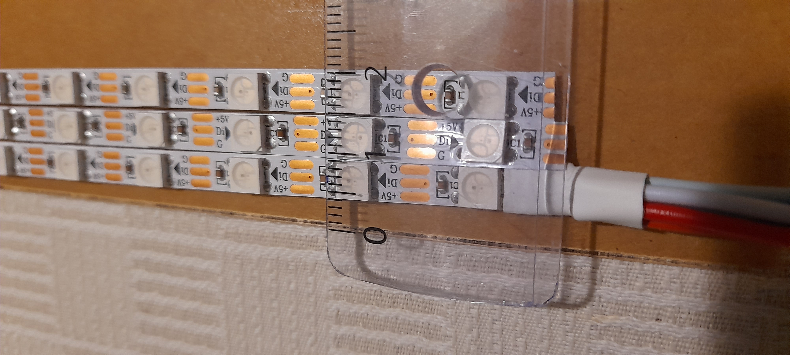

# Adventskranz

## Ziel

Lichteffekte mit einer Neopixel-Kette, die vier brennende Advents-Kerzen darstellen

## Hardware

## Status

In Arbeit.

* [x] Datum wird bestimmt
* [x] Kerzen werden gezeichnet
* [x] Kerzen brennen 'runter
* [ ] Flammen sollen flackern
* [ ] Darstellung soll 18 Uhr beginnen
* [ ] Kerzen sollen bis 23 Uhr abgrbrannt sein
* [ ] Kerzen sollen unterschiedlich abbrennen (die erste mehr, die vierte weniger)
* [ ] noch ein paar verspielte Lichteffekte zwischendurch
* [ ] was angepasstes für die Weihnachtstage

## Quellen

